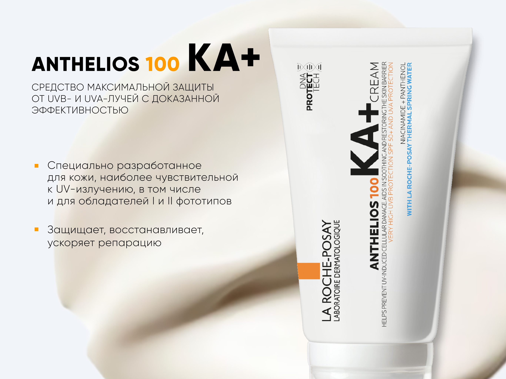

# Anthelios 100 KA+ – интерактивный промо-слайд ✨

Одностраничный интерактивный материал для презентации дерматологического крема Anthelios 100 KA+.
Слайд подчёркивает ключевые преимущества продукта и демонстрирует их через плавное появление
контента.



## ✨ Ключевая функциональность

- Последовательная анимация текстуры, продукта и текста создаёт эффект "живой" презентации.
- Пиксель-точное позиционирование элементов с использованием CSS-переменных и кастомного шрифта
  Gilroy.
- Использование анимации на чистом JavaScript без тяжёлых библиотек – легко поддерживать и
  кастомизировать.
- Статические ассеты (PNG, WOFF2) оптимизированы под офлайн-презентации и рассылки.
- Готовые npm-скрипты для запуска, линтинга и форматирования повышают качество и стабильность кода.

## 🛠️ Технологический стек

- **Интерфейс:** HTML, CSS, JavaScript – чистая реализация без фреймворков.
- **Анимации и UI:** CSS Transitions, requestAnimationFrame, setTimeout.
- **Инструменты разработки:** Node.js, NPM, Serve.
- **Качество кода:** ESLint, Stylelint, Prettier
- **Графика и типографика:** PNG-ассеты, кастомные шрифты в формате WOFF2.

## 🚀 Установка и запуск

1. Установите Node.js версии 22 или новее.
2. Клонируйте репозиторий и перейдите в папку проекта:

   ```bash
   git clone https://github.com/IrinaRyazanskaya/anthelios-derm.git
   cd anthelios-derm
   ```

3. Установите зависимости:

   ```bash
   npm install
   ```

4. Запустите локальный сервер:

   ```bash
   npm start
   ```

   Слайд будет доступен по адресу `http://localhost:3000/slide-1/slide-1.html`.

5. Для контроля качества кода доступны команды:

   ```bash
   npm run format          # Автоформатирование с помощью Prettier
   npm run lint            # Комплексная проверка линтерами
   npm run lint:ts         # Проверка кода линтером ESLint
   npm run lint:styles     # Проверка стилей линтером Stylelint
   npm run lint-fix        # Автоматическое исправление ошибок линтинга
   npm run lint-fix:ts     # Автоисправление замечаний ESLint
   npm run lint-fix:styles # Автоисправление замечаний Stylelint
   ```

## 📁 Структура проекта

```text
anthelios-derm/
├── fonts/
│   ├── Gilroy-Extrabold.woff2
│   └── Gilroy-Light.woff2
├── slide-1/
│   ├── images/
│   │   ├── cream-texture.png
│   │   └── cream.png
│   ├── slide-1.css           # Стили слайда Anthelios 100 KA+
│   ├── slide-1.html          # Разметка слайда Anthelios 100 KA+
│   └── slide-1.js            # Анимации реализованные на JavaScript
├── styles.css                # Базовые стили и подключение шрифтов
├── package.json              # Скрипты npm и список зависимостей
├── eslint.config.mjs         # Правила линтинга JS/TS
├── .editorconfig             # Единые правила оформления кода
├── .gitignore                # Игнорируемые Git-ом файлы
├── .prettierignore           # Исключения для Prettier
├── .prettierrc.json          # Конфигурация Prettier
├── .stylelintrc.json         # Правила линтинга стилей
└── .prettierrc.json          # Настройки автоформатирования
```

## 💡 Что реализовано/изучено

- Отработан полный цикл создания промо-слайда: дизайн, вёрстка, анимация и подготовка ассетов.
- Заложен подход к разметке с использованием БЭМ, который можно масштабировать на серию слайдов.
- Реализована адаптивность анимаций к пользовательским настройкам доступности.
- Настроены проверки качества кода с использованием ESLint, Stylelint и Prettier.
- Подготовлены NPM-скрипты для быстрого запуска и поддержания проекта.

## 📚 Решённые задачи и технические челленджи

- **Эффектная анимация без перегрузки:** Последовательный показ элементов с контролем таймингов
  обеспечивает внимание к ключевым сообщениям.
- **Поддержка работы из кэша:** Обработчик `pageshow` перезапускает анимацию при возврате на
  страницу – слайд всегда выглядит «свежим».
- **Уважение к пользовательским настройкам:** Логика на JavaScript проверяет
  `prefers-reduced-motion` и выключает анимацию для пользователей, которым она мешает.
- **Унификация стиля:** Набор инструментов (ESLint, Stylelint, Prettier) помогает поддерживать
  качество кода и облегчает работу в команде.
- **Готовность к оффлайн-режиму:** все ассеты локальные, поэтому слайд можно демонстрировать без
  интернета.

## 📦 Подготовка презентации для загрузки в систему

- В корне архива должны находиться `index.html` (точка входа) и `preview.png` с превью слайда.
- `index.html` перенаправляет пользователя на первый слайд `slide-1/slide-1.html` по относительному
  пути — решение совместимо с офлайн-режимом.
- Перед отдачей клиенту соберите zip-архив с уникальным именем, например:

  ```bash
  zip -r anthelios-100-ka-plus.zip index.html preview.png slide-1 styles.css fonts
  ```

  При необходимости добавьте в команду дополнительные каталоги и файлы (видео, дополнительные слайды
  и т. д.).

- Все пути внутри HTML, CSS и JS остаются относительными, поэтому презентация работает без
  подключения к сети.

## 📊 Сбор статистики

- В `slide-1/slide-1.js` реализован универсальный помощник `postStatisticsEvent`, который отправляет
  события в контейнер через `window.ReactNativeWebView.postMessage`.
- При каждой загрузке слайда (в том числе после возврата из Back-Forward Cache) автоматически
  отправляется событие `openSlide` с идентификатором `slide-1` и названием продукта.
- Для добавления дополнительных событий (например, активности, чекбоксов, переходов к другим
  презентациям) вызывайте `postStatisticsEvent` с нужной структурой `dataJSON` согласно требованиям
  клиента:

  ```js
  postStatisticsEvent({
    eventType: "activity",
    slide: "slide-1",
    question: "Открыта ли дополнительная информация о лекарстве?",
    value: "Да",
  });
  ```

- Если презентация открыта в обычном браузере (без контейнера React Native), события отправляться не
  будут, что упрощает локальную разработку.
